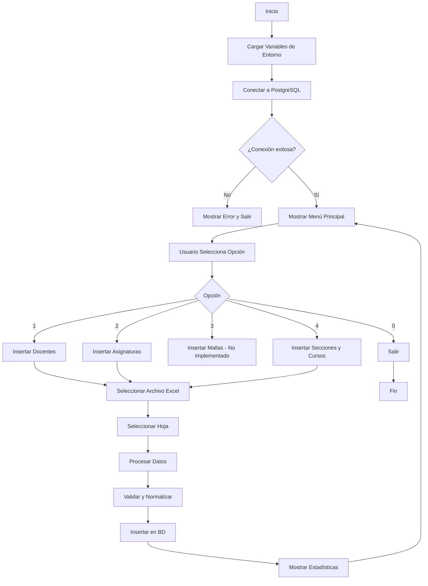

# Sistema de Transferencia de Datos - Documentación Principal

## 📋 Tabla de Contenidos

1. [Descripción General](#descripción-general)
2. [Arquitectura del Sistema](#arquitectura-del-sistema)
3. [Flujo General del Script](#flujo-general-del-script)
4. [Manual del Menú Principal](#manual-del-menú-principal)
5. [Requisitos Previos](#requisitos-previos)
6. [Instrucciones de Ejecución](#instrucciones-de-ejecución)
7. [Estructura de Archivos](#estructura-de-archivos)

---

## Descripción General

El **Sistema de Transferencia de Datos** es una herramienta Python diseñada para importar datos desde archivos Excel hacia una base de datos PostgreSQL. El sistema está especializado en la gestión de información académica, incluyendo docentes, asignaturas, secciones y cursos.

### Características Principales

- ✅ **Interfaz de menú interactiva** para seleccionar operaciones
- ✅ **Procesamiento robusto de datos** con normalización y validación
- ✅ **Detección automática de duplicados** con consolidación inteligente
- ✅ **Generación automática de correos** para docentes sin correo electrónico
- ✅ **Manejo de errores** con reportes detallados
- ✅ **Inserción masiva optimizada** usando transacciones PostgreSQL

---

## Arquitectura del Sistema

```
app.py (Punto de Entrada)
    ├── helpFunctions.py (Utilidades)
    ├── appendDocs.py (Inserción de Docentes)
    ├── appendAsign.py (Inserción de Asignaturas)
    └── appendSeccCur.py (Inserción de Secciones y Cursos)
```

### Componentes

| Componente | Responsabilidad |
|------------|----------------|
| `app.py` | Menú principal, conexión a BD, orquestación |
| `helpFunctions.py` | Normalización, procesamiento Excel, utilidades |
| `appendDocs.py` | Lógica de inserción y validación de docentes |
| `appendAsign.py` | Lógica de inserción y validación de asignaturas |
| `appendSeccCur.py` | Lógica de inserción de secciones y cursos |

---

## Resumen de Comparación

| Característica | appendDocs.py | appendAsign.py | appendSeccCur.py |
|----------------|---------------|----------------|------------------|
| **Complejidad** | Alta | Media | Muy Alta |
| **Detección de duplicados** | ✅ Avanzada | ✅ Básica | ✅ Por constraint |
| **Generación automática** | ✅ Correos | ❌ | ❌ |
| **Actualización de registros** | ✅ Correos | ❌ | ❌ |
| **Validación de relaciones** | ❌ | ✅ Departamentos | ✅ Docentes + Asignaturas |
| **Soporte múltiples valores/fila** | ✅ | ❌ | ✅ |
| **Caché en memoria** | Parcial | Parcial | Completo |

---

---

## Flujo General del Script



### Proceso Detallado

1. **Inicialización**
   - Carga variables de entorno desde `.env`
   - Establece conexión con PostgreSQL
   - Valida credenciales y esquema

2. **Selección de Operación**
   - Usuario elige una opción del menú
   - Sistema solicita archivo Excel correspondiente

3. **Procesamiento de Datos**
   - Lectura de archivo Excel
   - Extracción de columnas específicas
   - Normalización y limpieza de datos
   - Validación de integridad

4. **Inserción en Base de Datos**
   - Detección de duplicados
   - Consolidación automática
   - Inserción masiva optimizada
   - Manejo de transacciones

5. **Reporte de Resultados**
   - Estadísticas de procesamiento
   - Registros insertados/omitidos
   - Errores encontrados

---

## Manual del Menú Principal

### Opción 1: Insertar Docentes

**Descripción:** Importa información de docentes desde un archivo Excel a la tabla `docentes`.

**Archivo Excel Requerido:**
- **Columnas:** Apellidos (columna 12), Nombres (columna 13), Correos (columna 14)
- **Fila de inicio:** 12 (las primeras 11 filas se ignoran)
- **Formato:** Cada fila puede contener múltiples docentes separados por saltos de línea (`\n`)

**Proceso:**
1. Extrae datos de las columnas especificadas
2. Formatea nombres completos (nombre + apellido)
3. Genera correos genéricos para docentes sin correo
4. Detecta y consolida duplicados automáticamente
5. Prioriza correos institucionales (`@pol.una.py`)
6. Actualiza correos existentes si encuentra mejores (genéricos → institucionales)
7. Inserta nuevos registros en la base de datos

**Tablas Afectadas:**
- `docentes` (INSERT y UPDATE)

**Ejemplo de Datos Excel:**
```
Columna 12 (Apellidos)    | Columna 13 (Nombres)    | Columna 14 (Correos)
González                  | Juan Carlos             | juan.gonzalez@pol.una.py
Pérez                     | María                   | 
```

**Impacto en BD:**
- ✅ Inserta nuevos docentes
- ✅ Actualiza correos de docentes existentes (si encuentra mejor)
- ✅ Genera correos genéricos únicos para docentes sin correo
- ⚠️ Omite duplicados detectados automáticamente

---

### Opción 2: Insertar Asignaturas

**Descripción:** Importa asignaturas desde un archivo Excel a la tabla `asignaturas`.

**Archivo Excel Requerido:**
- **Columnas:** Departamento (columna 1), Asignatura (columna 2)
- **Fila de inicio:** 12
- **Formato:** Cada fila representa una asignatura

**Proceso:**
1. Valida que el departamento exista en la tabla `departamentos`
2. Estandariza nombres de asignaturas (corrige typos, convierte números a romanos)
3. Elimina duplicados por combinación (nombre, departamento)
4. Inserta nuevas asignaturas en la base de datos

**Tablas Afectadas:**
- `asignaturas` (INSERT)
- `departamentos` (solo lectura para validación)

**Ejemplo de Datos Excel:**
```
Columna 1 (Departamento)  | Columna 2 (Asignatura)
ING. ELEC                  | Base de Datos
ING. ELEC                  | Software 1
```

**Estandarización Aplicada:**
- "Software 1" → "Software I"
- "sotfware" → "Software"
- "datamining" → "Data Mining"
- Limpieza de caracteres especiales

**Impacto en BD:**
- ✅ Inserta nuevas asignaturas
- ⚠️ Omite asignaturas que ya existen (mismo nombre y departamento)
- ❌ Rechaza asignaturas con departamentos no válidos

---

### Opción 3: Insertar Mallas

**Descripción:** Función planificada para importar mallas curriculares (actualmente no implementada).

**Estado:** ⚠️ **NO IMPLEMENTADO** - El código está comentado en `app.py` (línea 84)

**Columnas Esperadas:**
- Asignatura (columna 0)
- Carrera (columna 1)
- Semestre (columna 2)

**Fila de inicio:** 0

---

### Opción 4: Insertar Secciones y Cursos

**Descripción:** Crea secciones (docente + asignatura) y cursos (sección + año + periodo) desde un archivo Excel.

**Archivo Excel Requerido:**
- **Columnas:** Asignatura (columna 2), Apellidos (columna 12), Nombres (columna 13), Correos (columna 14)
- **Fila de inicio:** 12
- **Formato:** Soporta múltiples docentes por fila (separados por `\n`)

**Datos Adicionales Solicitados:**
- **Año:** Año académico (ej: 2026)
- **Periodo:** 1 o 2 (semestre)

**Proceso:**
1. Carga catálogos de asignaturas y docentes desde BD
2. Busca asignaturas por nombre normalizado
3. Busca docentes por correo (prioritario) o nombre normalizado
4. Crea secciones nuevas si no existen (docente + asignatura)
5. Crea cursos nuevos para el período especificado
6. Detecta y omite duplicados en Excel y BD

**Tablas Afectadas:**
- `secciones` (INSERT)
- `cursos` (INSERT)

**Ejemplo de Datos Excel:**
```
Columna 2 (Asignatura)     | Columna 12 (Apellidos) | Columna 13 (Nombres) | Columna 14 (Correos)
Base de Datos              | González                | Juan                 | juan.gonzalez@pol.una.py
Software I                 | Pérez                   | María                | maria.perez@pol.una.py
                           | López                   | Carlos               | carlos.lopez@pol.una.py
```

**Impacto en BD:**
- ✅ Crea nuevas secciones (combinación única de docente + asignatura)
- ✅ Crea nuevos cursos (sección + año + periodo)
- ⚠️ Omite secciones/cursos que ya existen
- ❌ Rechaza registros con asignaturas o docentes no encontrados

**Nota:** Si una fila contiene múltiples docentes (separados por `\n`), se crea una sección y curso para cada docente con la misma asignatura.

---

### Opción 0: Salir

Cierra la conexión a la base de datos y termina la ejecución del script.

---

## Requisitos Previos

### Software

| Requisito | Versión Mínima | Descripción |
|-----------|----------------|-------------|
| Python | 3.7+ | Lenguaje de programación |
| PostgreSQL | 12+ | Base de datos |
| pip | - | Gestor de paquetes Python |

### Dependencias Python

Instalar desde `requirements.txt`:

```bash
pip install -r requirements.txt
```

**Dependencias principales:**
- `psycopg2-binary>=2.9.0` - Driver PostgreSQL
- `python-dotenv>=1.0.0` - Manejo de variables de entorno
- `openpyxl>=3.1.0` - Lectura de archivos Excel
- `tabulate>=0.9.0` - Formato de tablas (opcional)

### Base de Datos

**Esquema requerido:**
- Schema: `polirank_test` (configurable en `.env`)
- Tablas necesarias:
  - `departamentos` (con columna `siglas`)
  - `docentes` (con constraint única en `correo`)
  - `asignaturas` (con constraint única en `(nombre, dpto)`)
  - `secciones` (con constraint única en `(docente, asignatura)`)
  - `cursos` (con constraint única en `(seccion, year, periodo)`)

### Configuración

**Archivo `.env` en la raíz del proyecto:**

```env
DB_HOST=localhost
DB_USER=postgres
DB_PASSWORD=tu_contraseña
DB_NAME=polirankDB
DB_SCHEMA=polirank_test
DB_PORT=5432
```

---

## Instrucciones de Ejecución

### 1. Preparar el Entorno

```bash
# Navegar al directorio del script
cd utils/Scripts/dataTransfer

# Instalar dependencias
pip install -r requirements.txt
```

### 2. Configurar Variables de Entorno

Crear o editar el archivo `.env` en la raíz del proyecto con las credenciales de PostgreSQL.

### 3. Ejecutar el Script

```bash
python app.py
```

### 4. Usar el Menú

1. El sistema mostrará el menú principal
2. Seleccione una opción (1-4 o 0 para salir)
3. Seleccione el archivo Excel cuando se solicite
4. Elija la hoja del Excel (si hay múltiples)
5. Espere a que se procesen los datos
6. Revise las estadísticas mostradas

### Ejemplo de Ejecución

```
===================================
   SISTEMA DE GESTIÓN DE MALLA
===================================
[1] Insertar Docentes
[2] Insertar Asignaturas
[3] Insertar Mallas
[4] Insertar Secciones y Cursos
[0] Salir
===================================
Selecciona una opción: 1

📂 Abriendo ventana de selección...
✅ Archivo seleccionado: docentes_2026.xlsx
✅ Hoja única detectada: Hoja1

🔍 Procesando 150 filas del Excel...
...
```

---

## Estructura de Archivos

```
utils/Scripts/dataTransfer/
├── app.py                          # Script principal y menú
├── requirements.txt                # Dependencias Python
├── README.md                       # Guía rápida de configuración
├── README_PRINCIPAL.md             # Este archivo
├── DOC_APPEND_FUNCTIONS.md        # Documentación de módulos de inserción
├── DOC_HELPERS.md                  # Documentación de funciones auxiliares
└── functions/
    ├── appendDocs.py               # Inserción de docentes
    ├── appendAsign.py              # Inserción de asignaturas
    ├── appendSeccCur.py            # Inserción de secciones y cursos
    └── helpFunctions.py            # Funciones auxiliares
```

---

## Solución de Problemas

### Error: "Faltan variables de entorno"

**Causa:** El archivo `.env` no existe o está incompleto.

**Solución:** Verificar que el archivo `.env` existe en la raíz del proyecto y contiene todas las variables requeridas.

### Error: "No se puede conectar a la base de datos"

**Causas posibles:**
- PostgreSQL no está corriendo
- Credenciales incorrectas
- Base de datos o schema no existe

**Solución:** Verificar que PostgreSQL esté activo y que las credenciales en `.env` sean correctas.

### Error: "Departamento desconocido"

**Causa:** La sigla del departamento en el Excel no coincide con ninguna en la tabla `departamentos`.

**Solución:** Verificar que las siglas en el Excel coincidan exactamente (mayúsculas/minúsculas) con las de la base de datos.

### Error: "Asignatura no encontrada" (Opción 4)

**Causa:** El nombre de la asignatura en el Excel no coincide con ninguna en la tabla `asignaturas`.

**Solución:** Asegurarse de que las asignaturas ya estén insertadas usando la Opción 2 antes de usar la Opción 4.

---

## Documentación Adicional

- **[DOC_APPEND_FUNCTIONS.md](./DOC_APPEND_FUNCTIONS.md)** - Documentación detallada de los módulos de inserción
- **[DOC_HELPERS.md](./DOC_HELPERS.md)** - Documentación de funciones auxiliares y normalización

---

**Última actualización:** 2024
